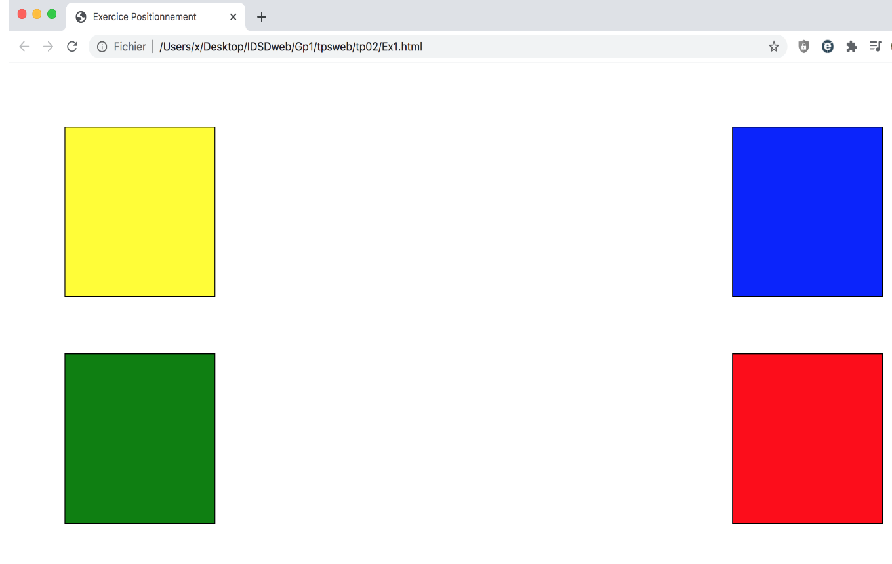
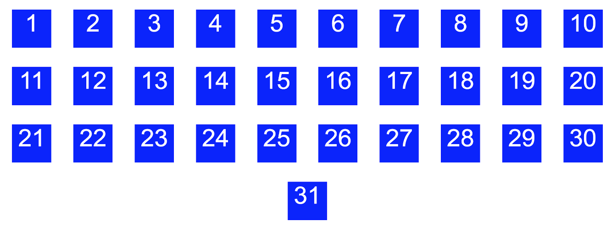

# TP-CSS
<h1>Un exercice sur les feuilles de styles CSS</h1>
<ol>
  <li>Aprés avoire clonner correctement le repository, créer sur le répertoire de travaille 4 répertoire : ex1, ex2, ex3 et ex4.</li>
  <li>Dans ex1 créez un fichier style.css et un fichier index.html</li>
  <li>Modifiez le fichier ex1/index.html et ex1/style.css pour obtenir ce que vous pouvez voir dans image </li>
  <li>Dans le dossier ex2 créez un fichier style.css et un fichier index.html</li>
  <li>Modifiez le fichier style.css pour obtenir le résultat suivant dans l'image </li>
</ol>
